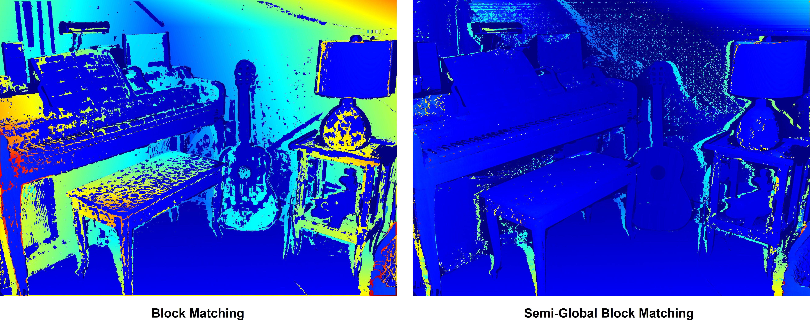

# Stereo Reconstruction 

This is a simple implmentation of Stereo Reconstruction pipleline, this project can be divided into two parts, **Sparse Matching** and **Dense Matching**. For more details, please read our [report](docs/Stereo_Reconstruction_Comparison_And_Analysis_Report.pdf).

**Sparse Matching**: Feature detection, pose estimation, Bundle Adjustment pose optimization

**Dense Matching**: Local or global block matching

## Pipeline


In Sparse Matching phase, we read two images and find correspondences by different feature descriptors. Afterwards, we're able to recover the camera pose by point pairs. Bundle Adjustment is then used to optimize the derived pose.

When a well-computed pose is avaliable, we're allowed to rectify two images to make them in the same plane. Once the rectification is done (In our project, we use rectified groundtruth for Dense Matching), we start the Block Matching. Two types of matching method will be used and compared. The result can be found in section *Comparison*. 


## Dataset 
We use [Middlebury 2014 Dataset](https://vision.middlebury.edu/stereo/data/scenes2014/). You can find some images for testing in directory `./data/Middlebury_2014/`. 

## Result 
The following figure shows the match result of different feature descriptors.


The following figure shows the final output for mesh reconstruction from 
depth map.


## Comparison

### Feature Descriptor

 |                         | SURF  | SIFT  | BRISK | KAZE  | AKAZE |  ORB   |
 | :---------------------: | :---: | :---: | :---: | :---: | :---: | :----: |
 | Number of found matches | 16817 | 15064 | 6750  | 3662  | 3520  |  500   |
 |    Averaged distance    | 0.02  | 26.98 | 75.11 | 0.026 | 72.99 | 123.03 |
 |      Running time       | 1.012 | 1.896 | 0.294 | 4.697 | 0.828 | 0.351  |

### Pose error
|            |       SURF       |       SIFT       |      BRISK       |       KAZE       |      AKAZE       |       ORB        |
| :--------: | :--------------: | :--------------: | :--------------: | :--------------: | :--------------: | :--------------: |
|   R / T    | 0.0041 / 0.14638 | 0.0016 / 0.14637 | 0.1610 / 0.14852 | 0.0048 / 0.14637 | 0.0017 / 0.14637 | 0.5294 / 0.15237 |
| R / T (BA) | 0.0013 / 0.14637 | 0.0007 / 0.14637 | 0.1807 / 0.14798 | 0.0003 / 0.14637 | 0.0020 / 0.14637 | 0.3418 / 0.15097 |

### Metrics of BM/SGBM
In order compare BM and SGBM we used different error
and accuracy metrics that we calculated using a ground truth
disparity map. One error function is the root mean squared, which measures the mean difference between the calculated
disparity D and the ground truth G with size $D_w \times D_h$. 

$$
RMS(D, G) = \sqrt{\frac{1}{D_wD_h} \sum_{x=0}^{w} \sum_{y=0}^{h} (D_{x,y} - G_{x,y})^2}
$$

An-
other function which does not determine the error rate but
the accuracy is $BAD_\alpha$ with $\alpha \in \{1,2,5\}$ which is defined
as

$$
    BAD_{\alpha} (D_{x,y}, G_{x,y}) = \frac{1}{D_w D_h} \sum_{x=0}^{w} \sum_{y=0}^{h} BAD_{\alpha} (D_{x,y}, G_{x,y})
$$
 | Method |   BM (Piano)   |  SGBM (Piano)  |   BM (Umbrella)   |  SGBM (Umbrella)  |
 | :----: | :-----: | :-----: | :-----: | :-----: |
 | BAD-1  | 51.8462 | 15.8732 | 76.7501 | 18.0213 |
 | BAD-2  | 52.0104 | 16.748  | 76.9073 | 19.1471 |
 | BAD-5  | 52.2857 | 18.9823 | 77.1587 | 21.8861 |
 |  RMS   | 90.5088 | 60.1341 | 133.462 | 55.843  |

Here is disparity and depth map for the Pianno-perfect and Umbrella-perfect. (a) Disparity map, (b) JET-colored disparity map, (c)
Depth map.


This is the error map applied with BM and SGBM, red refers to high deviation, blue means low error.


## Dependencies

- [OpenCV](https://opencv.org/) Vision library for image processing
- [Eigen](https://eigen.tuxfamily.org/index.php?title=Main_Page) Matrix computation library
- [g2o](https://github.com/RainerKuemmerle/g2o) Optimization library for Bundle Adjustment

## Getting started

I recommend to use vcpkg to manage our libraries, which is a package manager tool just like the pip for Python, maven for Java or npm for JavaScript. It's really convenient to use it to make our lives easier from building a bunch of related dependencies and so on. 

At first, you need to install vcpkg. You can find the installation tutorial [here](https://vcpkg.io/en/getting-started.html).

And then you'll need to install our dependencies.

For now, we only use Eigen, OpenCV and Ceres Solver.

- `vcpkg install eigen3`
- `vcpkg install opencv[contrib,nonfree]` (contrib, nonfree tag for using `xfeatures2d`)
- `vcpkg install g2o`

> For Windows please add suffix `:x64-windows`

> For MacOs you need to follow this issue to build opencv with opencv_contrib to have xfeatures2d [Solution](https://github.com/udacity/SFND_2D_Feature_Tracking/issues/3)


After installing these two libraries, you should be able to build the project by using Cmake.

**You May Change CXX Standard of the VS project manually. **

**Before Building:** Dont forget to change the path to your vcpkg in [`CmakeLists.txt`](CMakeLists.txt) at ***Line 4***.

## Project structure
The project folder should look like as following.
```
.
├── data
│   └── Middlebury_2014
│       └── ...
├── build
├── CMakeLists.txt
├── main.cpp
├── FeatureDetector.cpp
├── ...
└── README.md
```
## Members
- Sebastian Bauer 
- Chang Luo

## License
[MIT]()